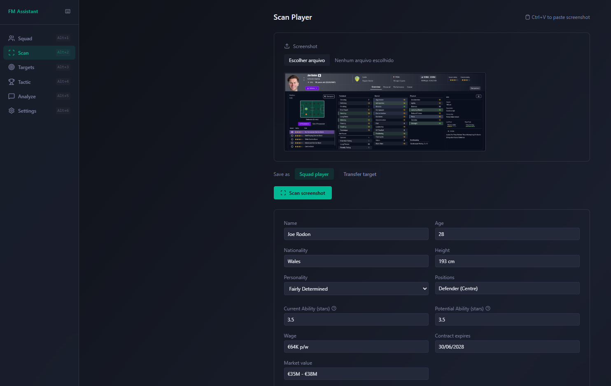

# FM AI Assistant

> An open-source, local AI-powered assistant for Football Manager — built by a fan, for fans.

<!-- screenshot -->


FM AI Assistant helps you make better decisions in Football Manager by combining your squad data with AI analysis. Scan player screenshots, build your squad database, describe your tactical setup, and ask for honest, data-driven recommendations on transfers, squad depth, and more.

This is an early-stage project built by a single person who loves the game. Contributions, feedback, bug reports, and pull requests are all genuinely welcome — I'll benefit from your improvements just as much as you will.

---

## Features

- **Screenshot scanning** — extract player data directly from FM screenshots using a vision AI model
- **Squad & target management** — build a local database of your players and transfer targets
- **Tactical context** — describe your system so the AI understands your style before recommending
- **AI analysis** — ask anything about your squad, transfers, or tactics and get honest, justified answers
- **Multi-provider support** — use Groq, Google Gemini, OpenAI, Anthropic, OpenRouter, or a local Ollama model
- **Fully local** — your save data never leaves your machine

---

## Requirements

- Python 3.10+
- Node.js 18+
- An API key for at least one supported model provider (or a local Ollama setup)

---

## Installation

### 1. Clone the repository

```bash
git clone https://github.com/BernardoAragaoDRibeiro/FM-AI-Assistant.git
cd fm-ai-assistant
```

### 2. Set up the backend

```bash
cd backend
python -m venv venv

# Windows
source venv/Scripts/activate

# macOS / Linux
source venv/bin/activate

pip install -r requirements.txt
```

### 3. Configure your API keys

```bash
cp .env.example .env
```

Open `.env` and add your API key:

```
GROQ_API_KEY=your_key_here
```

You can also configure your models directly in the app's Settings page after launching.

### 4. Set up the frontend

```bash
cd ../frontend
npm install
```

---

## Running the app

You'll need two terminals open.

**Terminal 1 — Backend:**

```bash
cd backend
source venv/Scripts/activate  # Windows
python -m uvicorn app.main:app --reload
```

**Terminal 2 — Frontend:**

```bash
cd frontend
npm run dev
```

Open [http://localhost:5173](http://localhost:5173) in your browser.

---

## Configuration

On first launch, go to **Settings** to configure your AI models:

- **Vision model** — used to extract player data from screenshots (needs image support)
- **Analysis model** — used for squad analysis and recommendations
- **Max output tokens** — adjust based on your provider's limits

### Recommended free options

| Provider | Vision | Analysis | Free tier |
|----------|--------|----------|-----------|
| Groq | `groq/qwen/qwen3.8-27b` | `groq/qwen/qwen3.8-27b` | Yes (1000 tokens/min) |
| Google Gemini | `gemini/gemini-2.0-flash` | `gemini/gemini-2.0-flash` | Yes (generous) |
| Ollama (local) | `ollama/llama3.2-vision` | `ollama/llama3` | No limits |

Get your free API keys here:
- [Groq](https://console.groq.com/keys)
- [Google AI Studio (Gemini)](https://aistudio.google.com/app/apikey)
- [OpenRouter](https://openrouter.ai/keys)

---

## How to use

1. **Scan** — go to the Scan page, upload a screenshot of a player's profile from FM, review the extracted data, correct any errors, and save
2. **Build your squad** — scan your current players and save them as squad members
3. **Add targets** — scan players you're considering signing and save them as transfer targets
4. **Set up tactics** — describe your formation and playing style in the Tactic page
5. **Analyze** — ask the assistant anything: *"Should I sign any of my targets?"*, *"What position does my squad need most?"*, *"Who are my weakest players?"*

### Tips for better scans

- Use the player's **Overview** tab for best results
- Make sure **CA/PA stars**, **traits**, and **contract details** are visible
- If data comes out wrong, you can correct it manually before saving
- For players you haven't fully scouted, attributes will show as ranges — the assistant will account for this uncertainty

---

## Known limitations

- Screenshot extraction accuracy varies by model — always review data before saving
- Groq free tier has a 1000 output tokens/minute limit, which can cut off long analyses — use Gemini or a local model for better results
- Traits that require scrolling to see in FM may not be captured — use the trait checklist to add them manually
- This project is in early development — expect rough edges

---

## Contributing

This project is in its early stages and contributions are very welcome. Whether you want to fix a bug, improve the UI, add support for a new model provider, or just share feedback — please do.

- **Found a bug?** Open an issue
- **Have an idea?** Open an issue or start a discussion
- **Want to contribute code?** Fork the repo, create a branch, and open a pull request
- **Not a developer?** Testing the app and reporting what goes wrong is just as valuable

I built this because I wanted it to exist. If you improve it, I benefit too.

---

## License

MIT — do whatever you want with it, just keep the credit.

---

*Built with FastAPI, React, LiteLLM, and too many hours in Football Manager.*